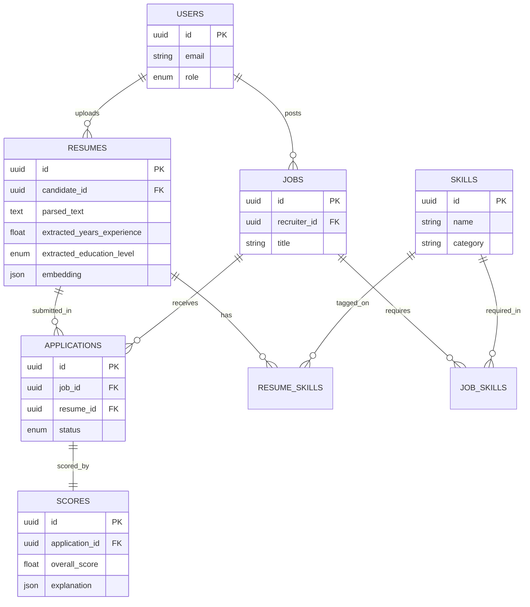

# Architecture

## Entity-Relationship Diagram



## AI Pipeline (Milestones 4-6)

```
Resume upload (PDF/DOCX)
  -> text extraction (pdfplumber / python-docx)
  -> text cleaning
  -> skill extraction (spaCy PhraseMatcher gazetteer)
  -> experience extraction (regex)
  -> education extraction (keyword matching)
  -> embedding generation (all-MiniLM-L6-v2, stored on Resume.embedding)

Recruiter search:
  job description text
  -> embedding
  -> FAISS IndexFlatIP assembled from all stored resume embeddings
  -> ranked results by cosine similarity
```

See [docs/MILESTONES.md](../MILESTONES.md) for the full narrative and every
real bug hit along the way.
