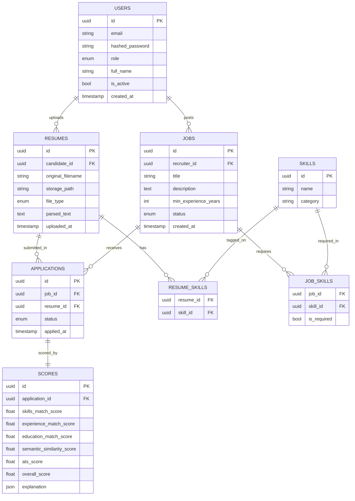

# Architecture

## Entity-Relationship Diagram

GitHub renders Mermaid diagrams natively in markdown -- this is the same
schema shown interactively during the build (see Milestone 2 in
[docs/MILESTONES.md](../MILESTONES.md)).



## System Architecture

```
Client (React/TS)
      |  HTTPS
      v
FastAPI (versioned REST API, /api/v1)
      |
      +--> PostgreSQL   (users, jobs, resumes, scores -- system of record)
      +--> Redis        (cache + Celery broker)
      +--> Celery workers (async: parsing, embedding generation, scoring)
```

Layered backend structure -- each layer depends only on the layer below it:

```
app/
|-- api/        HTTP layer: routers, request/response handling only
|-- schemas/    Pydantic request/response contracts
|-- services/   Business logic -- framework-agnostic
|-- models/     SQLAlchemy ORM models (persistence layer)
|-- ai/         NLP/ML pipeline (parsing, embeddings, scoring)
|-- workers/    Celery task definitions
|-- core/       Config, logging, security -- cross-cutting concerns
`-- db/         Database session/engine management
```

## Design decisions log

See [docs/MILESTONES.md](../MILESTONES.md) for the full narrative of *why*
each decision was made, including the real debugging history -- config
path resolution, port collisions, cross-dialect UUID/JSON handling, and
Alembic's custom-type import limitation. That file is the one worth
rereading before an interview; this one is the quick-reference diagram.
